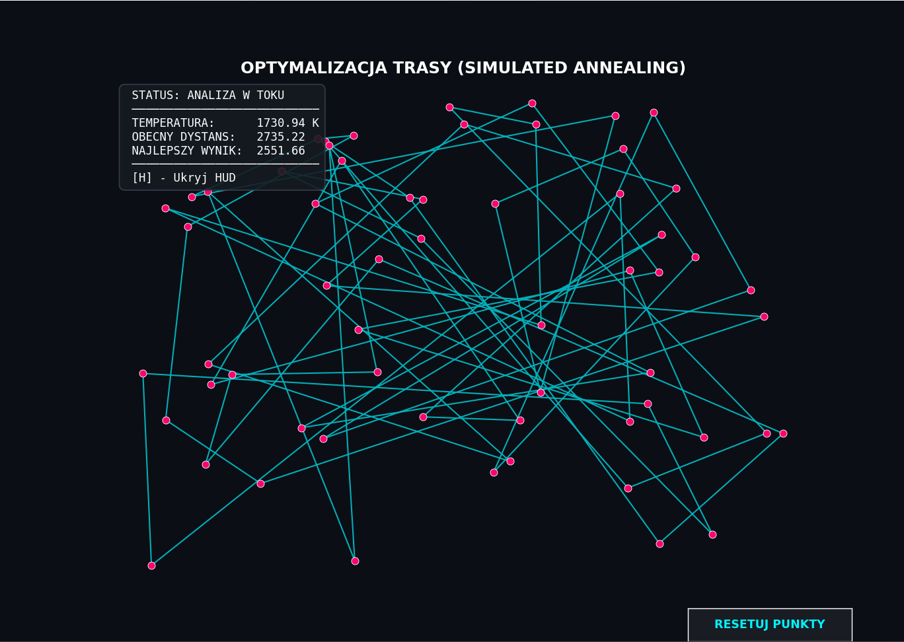
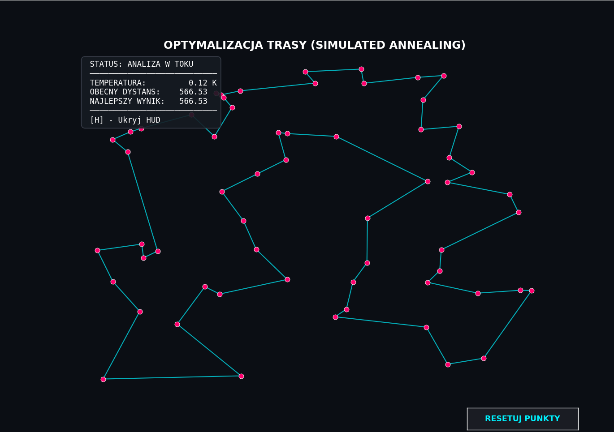

#  Symulowane Wyżarzanie - Problem Komiwojażera (TSP)
### Simulated Annealing for Traveling Salesperson Problem

Interaktywna wizualizacja algorytmu **Symulowanego Wyżarzania** (Simulated Annealing) rozwiązująca klasyczny **Problem Komiwojażera** (TSP). 

Projekt zrealizowany jako zaliczenie z przedmiotu **Fizyka Ogólna**, demonstrujący zastosowanie termodynamiki statystycznej w optymalizacji kombinatorycznej.

---

##  Zrzuty ekranu

| Faza początkowa (Wysoka Temp.) | Faza końcowa (Niska Temp.) |
|:------------------------------:|:--------------------------:|
|  |  |

---

##  Teoria i Fizyka
Algorytm opiera się na analogii do procesu wyżarzania w metalurgii. Fizyczną podstawą symulacji jest **rozkład Boltzmanna**:

$$P(E) \sim \exp\left(-\frac{E}{k_B T}\right)$$

Gdzie:
- **Energia ($E$)** = Całkowity dystans trasy (Hamiltonian układu).
- **Temperatura ($T$)** = Parametr sterujący prawdopodobieństwem akceptacji gorszych rozwiązań.
- **Stan mikroskopowy** = Konkretna permutacja miast.

W wysokiej temperaturze układ akceptuje niemal wszystkie zmiany (duża entropia, zachowanie podobne do cieczy/gazu), co pozwala na ucieczkę z minimów lokalnych. W miarę chłodzenia (zgodnie ze schematem geometrycznym $T_{k+1} = \alpha \cdot T_k$), układ "zastyga" w stanie o minimalnej energii (globalne minimum).

---

##  Funkcje
- **Algorytm 2-opt:** Zmiana topologii trasy poprzez odwracanie fragmentów ścieżki (usuwanie przecięć).
- **Kryterium Metropolisa:** Probabilistyczna akceptacja gorszych rozwiązań zależna od temperatury.
- **Wizualizacja w czasie rzeczywistym:** Płynna animacja procesu optymalizacji.
- **HUD (Head-Up Display):** Wyświetlanie aktualnej temperatury, energii i najlepszego wyniku.
- **Interaktywność:**
  - `[RESETUJ PUNKTY]` - Przycisk restartujący symulację z nowym układem miast.
  - `[H]` - Ukrywanie/pokazywanie panelu informacyjnego.

---

